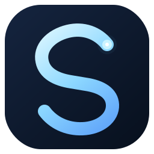
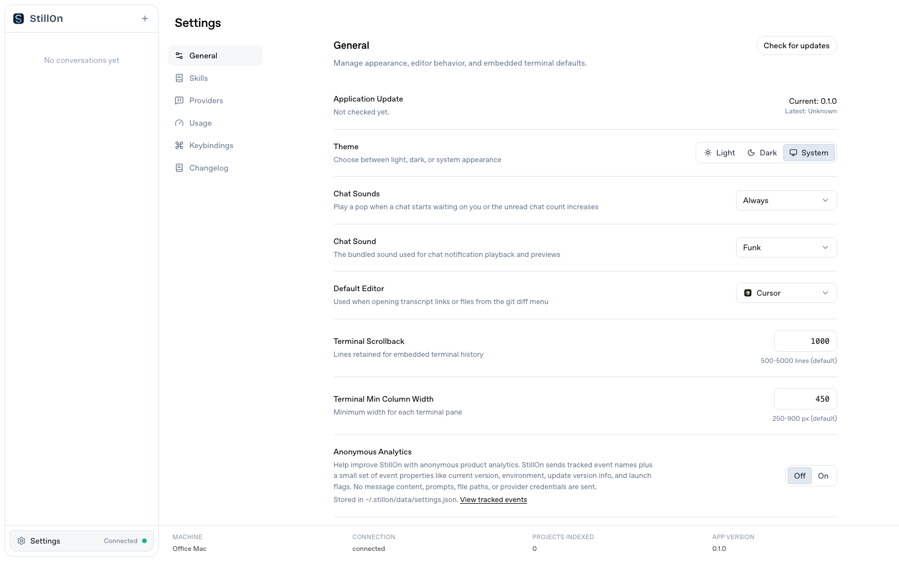

<p align="center">
  
</p>

<h1 align="center">StillOn</h1>

<p align="center">
  <strong>Leave your Mac. Keep your agents.</strong><br />
  You go. Your Claude Code and Codex agents stay on.
</p>

<p align="center">
  <a href="https://github.com/bzbj/stillon"></a>
  
  <a href="https://github.com/jakemor/kanna"></a>
</p>

<br />

<p align="center">
  <picture>
    <source media="(prefers-color-scheme: dark)" srcset="assets/screenshot.png" />
    <source media="(prefers-color-scheme: light)" srcset="assets/screenshot-light.png" />
    
  </picture>
</p>

StillOn turns an always-on Mac into a personal agent outpost. Leave the computer at home or in the office, then reconnect from an iPad, phone, or browser to continue local Claude Code and Codex sessions.

Your projects, credentials, processes, and chat history stay on your computer. StillOn provides the web workspace and local origin; an operator chooses and manages any external connection path. It does not move agent execution into a hosted cloud.

> Leave your computer. With StillOn, your agents stay on.

## Release status

StillOn is currently a **source-available public beta**. The supported launch scope is intentionally narrower than the long-term product:

| Platform | Status | Notes |
| --- | --- | --- |
| macOS 13+ | Primary | Main development and validation target |
| Linux | Beta | Core server works; desktop integrations vary by distribution |
| Windows 10/11 | Beta | Validated with PowerShell, Git, x64/ARM64 Bun, and Task Scheduler services |

The repository does not yet ship signed desktop installers. Install from source and review the [public-release readiness notes](docs/public-release-readiness.md) before exposing a machine outside your own network.
Versioned releases are explicit GitHub source releases; see the [release guide](docs/releasing.md).

## Quickstart

Install [Bun](https://bun.sh) v1.3.5 or newer, then:

```bash
git clone https://github.com/bzbj/stillon.git
cd stillon
bun install
bun run build
bun run start
```

Open [localhost:3210](http://localhost:3210). A working Claude Code login is required for Claude sessions; Codex CLI is optional.

To install the command globally from this checkout:

```bash
bun install -g .
stillon
```

The supported command is `stillon`. Existing `kanna` launchers should be
replaced rather than kept as aliases; this avoids accidentally starting a
previous application after a migration.

## Windows

StillOn supports Windows 10/11 with Bun 1.3.5 or newer, Git, and PowerShell.
Install and validate from PowerShell:

```powershell
git clone https://github.com/bzbj/stillon.git
cd stillon
bun install --frozen-lockfile
bun run check
bun run test
bun run start -- --no-open
```

The server listens on `http://127.0.0.1:3210` by default. Codex and Claude
Code should be installed for the current Windows user and available on `PATH`;
StillOn resolves their `.cmd` shims on Windows. The optional background service
uses Task Scheduler and starts at sign-in.

Windows terminal sessions use the configured local shell. Unix-specific PTY
signals do not have direct Windows equivalents, so advanced terminal signal
handling has narrower automated coverage than macOS and Linux.

## Background service

After installing the `stillon` command globally, you can opt in to a native
per-user background service:

```bash
stillon service install
stillon service status
stillon service logs
stillon service uninstall
```

Use `stillon service install --port 4000` to choose a fixed port. Pass
`--env-file /absolute/path/to/stillon.env` to load a dedicated service-only
environment file. This is the supported way to persist a local proxy
configuration for Codex and Claude Code without copying the caller's whole
shell environment; see [agent egress](docs/production-runtime.md#agent-egress-system-vpn-and-local-proxy).
Managed
services always start with `--no-open` and `--strict-port`, so a port conflict
is reported instead of silently moving StillOn to a different address.

For an isolated, rollback-friendly production installation, follow
[Production runtime installs](docs/production-runtime.md). The service uses
the runtime directory that contains its `bin/stillon` entrypoint as its
working directory, rather than the directory from which `service install` was
run.

| Platform | Native integration | Lifecycle |
| --- | --- | --- |
| macOS | Per-user LaunchAgent | Starts at login and is kept alive by `launchd` |
| Linux | systemd user service | Starts with the user manager and restarts after exit |
| Windows | Per-user Task Scheduler task | Starts at sign-in with bounded failure retries |

On Linux, a user service normally stops when the user manager exits. To keep it
running after logout and start the user manager at boot, an administrator can
enable lingering for that account:

```bash
sudo loginctl enable-linger "$USER"
```

The service integration defaults to the normal loopback address and does not
store passwords or provision a tunnel. It can persist `--host`, `--remote`,
and `--trust-proxy` when an operator manages the external entrypoint; see
[External ingress](docs/external-ingress.md). Removing the service does not
remove projects or data under `~/.stillon/`.

Windows service management is included for forward compatibility, but the
broader Windows runtime remains planned rather than supported in this beta.

## Why StillOn

- **Remote continuation** — reach the same local coding-agent workspace from a laptop, tablet, or phone
- **Local execution** — agents run against the projects and credentials already on your computer
- **Claude and Codex** — switch providers, models, reasoning effort, permissions, and plan mode per chat
- **Usage visibility** — view Codex and Claude Code plan limits when the authenticated CLI exposes them
- **Persistent sessions** — resume chats with event-backed history, snapshots, and hydrated tool results
- **Project workspace** — organize chats by project, inspect Git state, run terminals, preview local apps, and attach files
- **Operator-managed ingress** — keep the local origin on loopback or connect it through your own proxy, tunnel, or network listener

## Remote access

StillOn gives an authenticated remote user access to local projects, agent
processes, file previews, Git operations, and terminals. Treat that access as
equivalent to granting control of your development account.

StillOn starts on `127.0.0.1` by default. It does not create a public URL,
Cloudflare Tunnel, or other external route. You may run a Cloudflare Tunnel,
another tunnel, a reverse proxy, or a direct network listener independently;
StillOn's supported local contract is documented in
[External ingress](docs/external-ingress.md). Use `--trust-proxy` only when a
trusted proxy is the sole route to the local origin.

## Development

```bash
bun run dev
bun run check
bun test
```

`bun run dev --port 3333` uses port 3333 for Vite and 3334 for the backend. Development mode supports explicit `--host`, `--remote`, and `--trust-proxy`; its default listener stays on loopback.

## Architecture

```text
Browser / iPad / phone
        ↕ HTTP + WebSocket
StillOn Bun server on your computer
        ├── project and chat event store
        ├── terminal, Git, uploads, and local previews
        └── Claude Agent SDK / Codex App Server
                         ↕
                Local projects and tools
```

StillOn uses React and Zustand in the browser, a Bun HTTP/WebSocket server, append-only JSONL event logs, and compacted snapshots.

## Local data and migration

New state is stored under `~/.stillon/`; per-project uploads, exports, and quick actions use `.stillon/` inside the project.

On first launch, StillOn automatically renames an existing `~/.kanna/` data root to `~/.stillon/`. Existing project attachments and quick actions under `.kanna/` remain readable, while new files use `.stillon/`.

Runtime configuration uses `STILLON_*` variables. Legacy `KANNA_*` variables
and the `kanna` command are not read by StillOn. Data migration is isolated to
the documented data roots above, so importing old history does not reactivate
old launch configuration.

Choose a non-sensitive machine label in **Settings → General → Machine Name**; it is shown in the sidebar and browser tab so remote sessions are easy to identify. `STILLON_MACHINE_NAME` remains supported as the initial default—for example, `STILLON_MACHINE_NAME="Office Mac"`.

## Release editions

StillOn is the product name. Working-dog names are release editions, similar to capability tiers. The current release is **Husky**; the planned sequence is documented in the code and may evolve.

## Origin and license

StillOn is independently maintained at [bzbj/stillon](https://github.com/bzbj/stillon) and is not part of GitHub's Kanna fork network. It contains code derived from [Kanna](https://github.com/jakemor/kanna).

The original copyright and license terms—including the named exception in the upstream license—remain in [LICENSE](LICENSE). Because that exception excludes named parties, this project describes itself as **source-available**, not OSI-approved open source. Obtain legal advice before commercial redistribution.

See the [brand guide](docs/brand.md), [security policy](SECURITY.md), and [public-release readiness notes](docs/public-release-readiness.md).

## Contributing

Issues and pull requests are welcome at [bzbj/stillon](https://github.com/bzbj/stillon). Please read [CONTRIBUTING.md](CONTRIBUTING.md) first.
