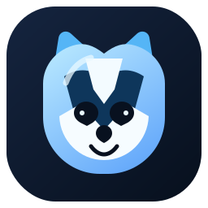
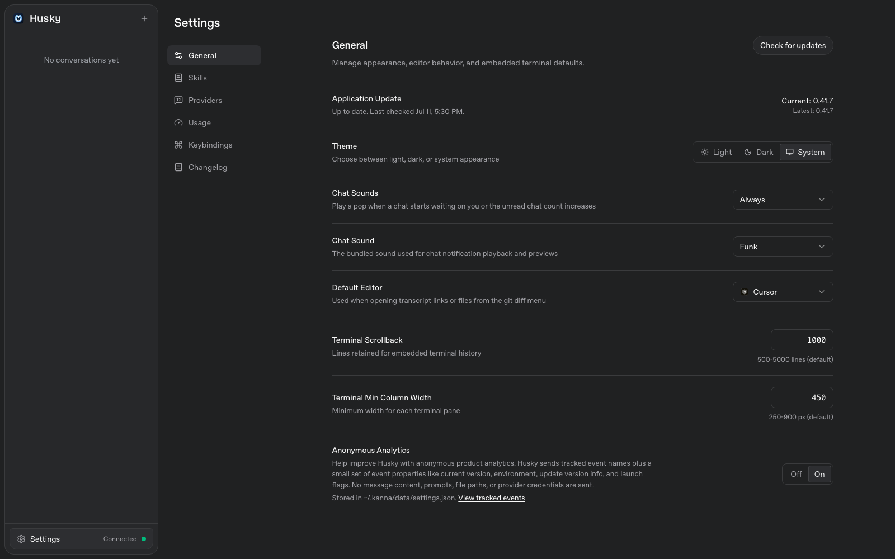

<p align="center">
  
</p>

<h1 align="center">Husky</h1>

<p align="center">
  <strong>The Husky edition — a local web workspace for Claude Code & Codex</strong>
</p>

<p align="center">
  <a href="https://github.com/bzbj/husky"></a>
  <a href="https://github.com/jakemor/kanna"></a>
</p>

<br />

<p align="center">
  <picture>
    <source media="(prefers-color-scheme: dark)" srcset="assets/screenshot.png" />
    <source media="(prefers-color-scheme: light)" srcset="assets/screenshot-light.png" />
    
  </picture>
</p>

<br />

## Husky

Husky is an independently maintained local workspace for Claude Code and Codex. It is a standalone GitHub repository at [bzbj/husky](https://github.com/bzbj/husky), built from the [Kanna](https://github.com/jakemor/kanna) codebase with its original copyright and license notices retained.

The Husky command is `husky`. The `~/.kanna` data directory remains in place for now so existing local projects and chat history continue to work without migration.

## Quickstart

If Bun isn't installed, install it first:

```bash
curl -fsSL https://bun.sh/install | bash
```

```bash
git clone https://github.com/bzbj/husky.git husky
cd husky
bun install
bun run build
bun run start
```

Open [`localhost:3210`](http://localhost:3210) in your browser.

## Features

- **Multi-provider support** — switch between Claude and Codex (OpenAI) from the chat input, with per-provider model selection, reasoning effort controls, and Codex fast mode
- **Husky model controls** — GPT-5.6 Codex support and Claude Fable 5 usage-limit visibility where the CLI account exposes it
- **Project-first sidebar** — chats grouped under projects, with live status indicators (idle, running, waiting, failed)
- **Drag-and-drop project ordering** — reorder project groups in the sidebar with persistent ordering
- **Local project discovery** — auto-discovers projects from both Claude and Codex local history
- **Rich transcript rendering** — hydrated tool calls, collapsible tool groups, plan mode dialogs, and interactive prompts with full result display
- **Quick responses** — lightweight structured queries (e.g. title generation) via Haiku with automatic Codex fallback
- **Plan mode** — review and approve agent plans before execution
- **Persistent local history** — refresh-safe routes backed by JSONL event logs and compacted snapshots
- **Auto-generated titles** — chat titles generated in the background via Claude Haiku
- **Session resumption** — resume agent sessions with full context preservation
- **WebSocket-driven** — real-time subscription model with reactive state broadcasting

## Architecture

```
Browser (React + Zustand)
    ↕  WebSocket
Bun Server (HTTP + WS)
    ├── WSRouter ─── subscription & command routing
    ├── AgentCoordinator ─── multi-provider turn management
    ├── ProviderCatalog ─── provider/model/effort normalization
    ├── QuickResponseAdapter ─── structured queries with provider fallback
    ├── EventStore ─── JSONL persistence + snapshot compaction
    └── ReadModels ─── derived views (sidebar, chat, projects)
    ↕  stdio
Claude Agent SDK / Codex App Server (local processes)
    ↕
Local File System (~/.kanna/data/, project dirs)
```

**Key patterns:** Event sourcing for all state mutations. CQRS with separate write (event log) and read (derived snapshots) paths. Reactive broadcasting — subscribers get pushed fresh snapshots on every state change. Multi-provider agent coordination with tool gating for user-approval flows. Provider-agnostic transcript hydration for unified rendering.

## Requirements

- [Bun](https://bun.sh) v1.3.5+
- A working [Claude Code](https://docs.anthropic.com/en/docs/claude-code) environment
- _(Optional)_ [Codex CLI](https://github.com/openai/codex) for Codex provider support

Embedded terminal support uses Bun's native PTY APIs and currently works on macOS/Linux.

## Install and update

Install from the Husky repository:

```bash
git clone https://github.com/bzbj/husky.git husky
cd husky
bun install
bun run build
```

To update an existing checkout:

```bash
git pull --ff-only origin main
bun install
bun run build
```

The source checkout can be run with `bun run start`. To install the local checkout as a CLI, run `bun install -g .` and use `husky`.

## Usage

```bash
bun run start                              # start with defaults (localhost only)
bun run start -- --port 4000               # custom port
bun run start -- --no-open                 # don't open a browser
bun run start -- --password <secret>       # require a password before loading the app
bun run start -- --share                   # create a public quick tunnel + terminal QR
bun run start -- --cloudflared <token>     # run a named Cloudflare tunnel from a token
```

Default URL: `http://localhost:3210`

### Network access (Tailscale / LAN)

By default Husky binds to `127.0.0.1` (localhost only). Use `--host` to bind a specific interface, or `--remote` as a shorthand for `0.0.0.0`:

```bash
bun run start -- --remote                     # bind all interfaces — browser opens localhost:3210
bun run start -- --host dev-box               # bind to a specific hostname — browser opens http://dev-box:3210
bun run start -- --host 192.168.1.x           # bind to a specific LAN IP
bun run start -- --host 100.64.x.x            # bind to a specific Tailscale IP
```

When `--host <hostname>` is given, the browser opens `http://<hostname>:3210` automatically. Other machines on your network can connect to the same URL:

### Password protection

Use `--password` to require a launch password before the app or websocket can connect:

```bash
bun run start -- --password my-secret
bun run dev --password my-secret
```

Husky verifies the password once, then sets a browser-session cookie. The password itself is not stored in the browser.
When password protection is enabled, the backend requires authentication for API routes and `/ws`. The SPA shell still loads, `/health` remains public for restart detection, and the same in-app password screen is used in both dev and production.

### Public share link

Use `--share` to create a temporary public `trycloudflare.com` URL and print a terminal QR code:

```bash
bun run start -- --share
bun run start -- --share --port 4000
bun run start -- --cloudflared <token>
```

`--share` is incompatible with `--host` and `--remote`. It does not open a browser automatically.

Without a token, it prints:

```text
QR Code:
...

Public URL:
https://<random>.trycloudflare.com

Local URL:
http://localhost:3210
```

With `--cloudflared <token>`, Husky runs `cloudflared tunnel run --token <token> --url <local-url>`.
If Husky can detect the public hostname from cloudflared output, it prints the same QR/public/local block.
If not, it keeps the tunnel running, warns that no public hostname was detected, and prints the local URL so you can use the hostname already configured for that tunnel in Cloudflare.

## Development

```bash
bun run dev
```

The same `--remote` and `--host` flags can be used with `bun run dev` for remote development.
`--share` is also supported in dev mode and exposes the Vite client URL publicly:

```bash
bun run dev --share
bun run dev --cloudflared <token>
bun run dev --port 3333 --share
```

In dev, `--port` sets the Vite client port and the backend runs on `port + 1`, so `bun run dev --port 3333 --share` publishes `http://localhost:3333`.
`--share` remains incompatible with `--host` and `--remote`.
Use `bun run dev --port 4000` to run the Vite client on `4000` and the backend on `4001`.

Or run client and server separately:

```bash
bun run dev:client   # http://localhost:5174
bun run dev:server   # http://localhost:5175
```

## Scripts

| Command              | Description                  |
| -------------------- | ---------------------------- |
| `bun run build`      | Build for production         |
| `bun run check`      | Typecheck + build            |
| `bun run dev`        | Run client + server together |
| `bun run dev:client` | Vite dev server only         |
| `bun run dev:server` | Bun backend only             |
| `bun run start`      | Start production server      |

## Project Structure

```
src/
├── client/          React UI layer
│   ├── app/         App router, pages, central state hook, socket client
│   ├── components/  Messages, chat chrome, dialogs, buttons, inputs
│   ├── hooks/       Theme, standalone mode detection
│   ├── stores/      Zustand stores (chat input, preferences, project order)
│   └── lib/         Formatters, path utils, transcript parsing
├── server/          Bun backend
│   ├── cli.ts       CLI entry point & browser launcher
│   ├── server.ts    HTTP/WS server setup & static serving
│   ├── agent.ts     AgentCoordinator (multi-provider turn management)
│   ├── codex-app-server.ts  Codex App Server JSON-RPC client
│   ├── provider-catalog.ts  Provider/model/effort normalization
│   ├── quick-response.ts    Structured queries with provider fallback
│   ├── ws-router.ts WebSocket message routing & subscriptions
│   ├── event-store.ts  JSONL persistence, replay & compaction
│   ├── discovery.ts Auto-discover projects from Claude and Codex local state
│   ├── read-models.ts  Derive view models from event state
│   └── events.ts    Event type definitions
└── shared/          Shared between client & server
    ├── types.ts     Core data types, provider catalog, transcript entries
    ├── tools.ts     Tool call normalization and hydration
    ├── protocol.ts  WebSocket message protocol
    ├── ports.ts     Port configuration
    └── branding.ts  App name, data directory paths
```

## Data Storage

All Husky state is stored locally at the compatibility path `~/.kanna/data/`:

| File             | Purpose                                   |
| ---------------- | ----------------------------------------- |
| `projects.jsonl` | Project open/remove events                |
| `chats.jsonl`    | Chat create/rename/delete events          |
| `messages.jsonl` | Transcript message entries                |
| `turns.jsonl`    | Agent turn start/finish/cancel events     |
| `snapshot.json`  | Compacted state snapshot for fast startup |

Event logs are append-only JSONL. On startup, Husky replays the log tail after the last snapshot, then compacts if the logs exceed 2 MB.

## Origin and license

Husky contains code derived from [Kanna](https://github.com/jakemor/kanna), but is maintained as an independent repository and is not part of its GitHub fork network. Original copyright and license terms, including the named exception in the upstream license, remain in [LICENSE](LICENSE).

## Contributing

Contributions are welcome! Please open pull requests against [bzbj/husky](https://github.com/bzbj/husky).

## License

See [LICENSE](LICENSE). It preserves the upstream Kanna license and copyright notice.
